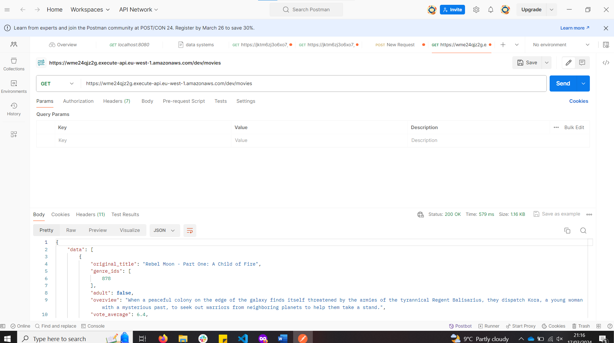

# DS CA 1 Assignment

## Coded By - Maxamed Maxamed

**Name:** Maxamed Maxamed  
**Student No:** 20088349

This repository contains an implementation of a serverless REST API for the AWS platform. The CDK framework is used to provision its infrastructure. The API's domain context is movie reviews.

## API Endpoints

- POST /movies/reviews - Add a movie review.
- GET /movies/{movieId}/reviews - Get all the reviews for a movie with the specified ID.
- GET /movies/{movieId}/reviews?minRating=n - Get all the reviews for the film with the specified ID whose rating was higher than the minRating.
- GET /movies/{movieId}/reviews/{reviewerName} - Get the review for the movie with the specified movie ID written by the named reviewer.

## Screenshots

### Terminal Display 

### Movies Display 

### Movie Reviews Details Display

### Movie Display Add

### Movie Review Add 

### AWS API Gateway 

## Issues

- I don't understand why movie reviews won't work.
- Adding movies via movieId, adding reviews, and try  to get reviews by name, ID, and rating are not working.
- I added sign-in and sign-out authentication, but it is not working. 

## Independent learning (If relevant).

- AWS CDK - [https://docs.aws.amazon.com/cdk/latest/guide/getting_started.html](https://docs.aws.amazon.com/cdk/latest/guide/getting_started.html)
- TypeScript - [https://www.typescriptlang.org/](https://www.typescriptlang.org/)
- Node - [https://nodejs.org/en/](https://nodejs.org/en/)
- AWS API Gateway - [https://docs.aws.amazon.com/apigateway/latest/developerguide/getting-started.html](https://docs.aws.amazon.com/apigateway/latest/developerguide/getting-started.html)
- AWS Lambda - [https://docs.aws.amazon.com/lambda/latest/dg/getting-started-create-function.html](https://docs.aws.amazon.com/lambda/latest/dg/getting-started-create-function.html)
- AWS DynamoDB - [https://docs.aws.amazon.com/amazondynamodb/latest/developerguide/GettingStartedDynamoDB.html](https://docs.aws.amazon.com/amazondynamodb/latest/developerguide/GettingStartedDynamoDB.html)

- These resources helped me gain the necessary knowledge to develop the serverless REST API using the CDK framework and integrate it with AWS services. However, further exploration and troubleshooting are required to resolve the current issues.

## Most Difficult part of the assignment 
# Authentication & Authorization

- I tried to set up a separate system for user login and registration, but I faced difficulties and couldn't complete it. Authentication is important for keeping user accounts secure, allowing them to sign up, log in, and log out. Authorization controls what actions users can perform - for example, only logged-in users can add or edit reviews.

# Amazon Translate Integration

- I wanted to add a feature that automatically translates reviews into different languages using Amazon Translate. This would have made the app more accessible to users who speak different languages. However, I had trouble with the setup and couldn't get it working properly. Despite this, I see the potential benefits of such a feature in making the app more user-friendly.